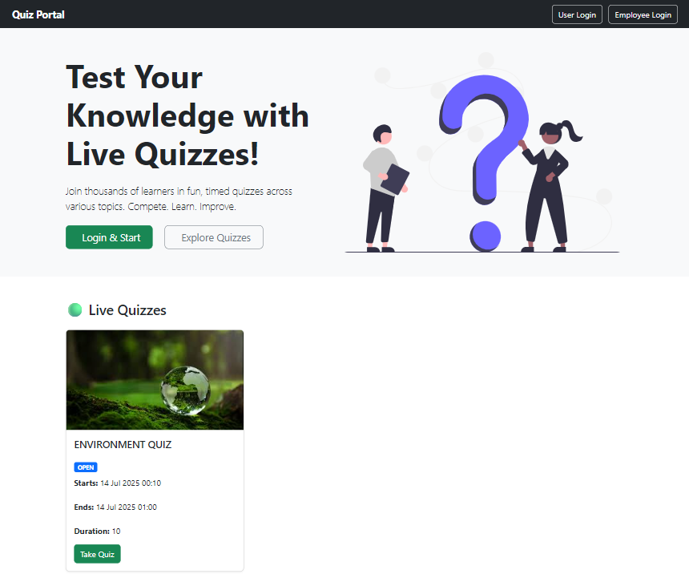
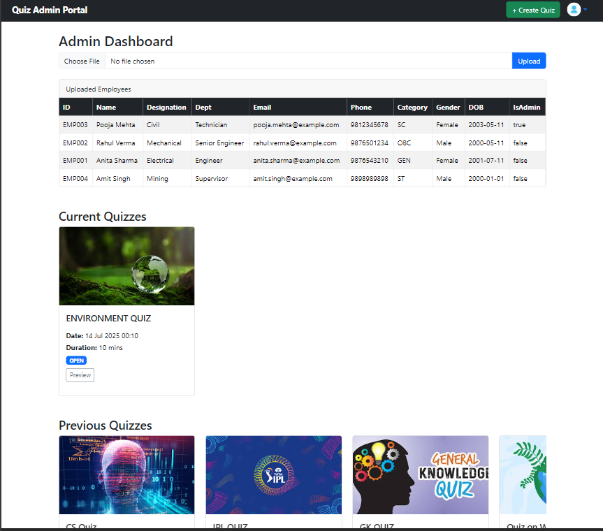
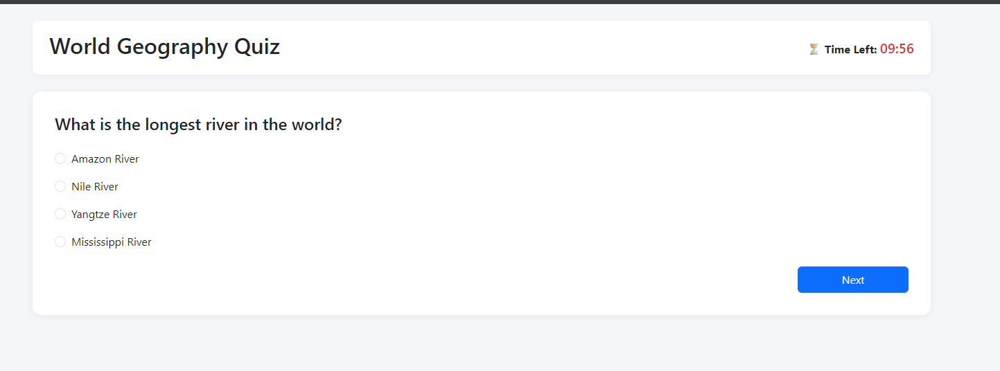
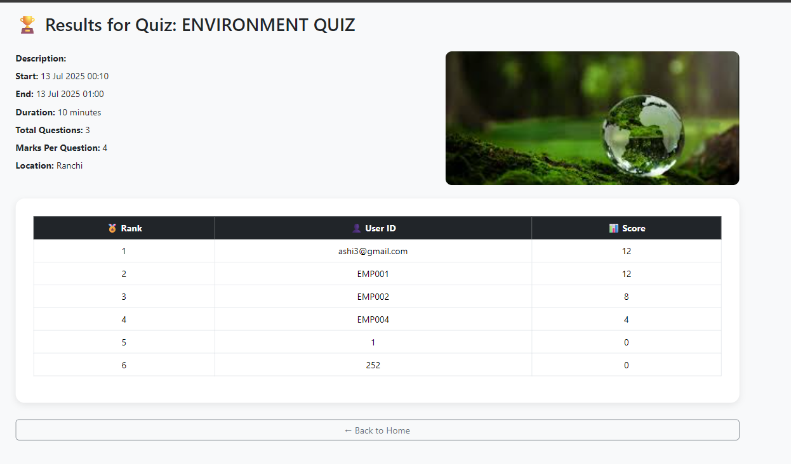

# 📚 Quiz Management Portal

Live Website: [https://quiz-portal-cewe.onrender.com/](https://quiz-portal-cewe.onrender.com/)

A full-stack **Quiz Management System** developed during my internship at **CMPDI, Ranchi**. This platform allows admins to create and manage quizzes for employees or registered users. Participants can take quizzes during specified time windows, and results are published by the admin after evaluation.

---

## 🚀 Tech Stack

- **Backend**: Spring Boot  
- **Frontend**: Thymeleaf (HTML, Bootstrap)  
- **Database**: PostgreSQL  
- **Tools**: Spring Security, JPA, Maven, PgAdmin  

---

## ✅ Features

### 👩‍💼 Admin Panel
- Create quizzes with:
  - Title, description, image
  - Start/end datetime for login and quiz attempts
  - Target audience: *Open* or *Employee-only*
  - Location, number of questions, and duration
- Upload employee master data via Excel
- Add MCQs or text-based questions
- Securely encrypt all answers in the database
- Edit/delete quizzes and questions
- Publish results once quiz ends

### 🧑‍💻 Employee/User Portal
- Login using Job ID & DOB (for employees) or Email/Password (for registered users)
- View current, upcoming, and previous quizzes
- Attempt quizzes only during valid time window
- Auto-submit when time expires
- View results once published

---

## 🔒 Authentication & Roles

- **Admin** – Create/manage quizzes and view results  
- **Employee** – Attempt assigned quizzes using Job ID & DOB  
- **User** – Register/login using email and take public quizzes

---

## 📷 Screenshots
### 🔹 User Dashboard View

### 🔹 Admin Dashboard View

### 🔹 Take Quiz Interface

### 🔹 Results Page

---

## 🙌 Acknowledgments
Special thanks to the team at CMPDI, Ranchi for their mentorship and support during this project.

## 📜 License
This project is for educational purposes and not intended for commercial use.
